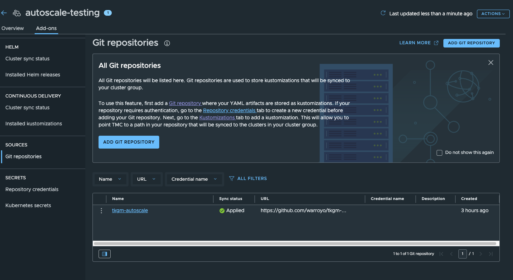
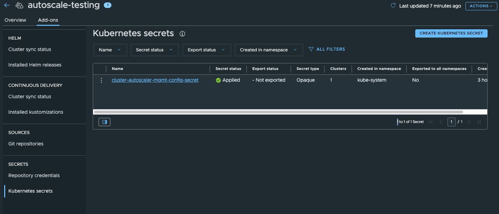
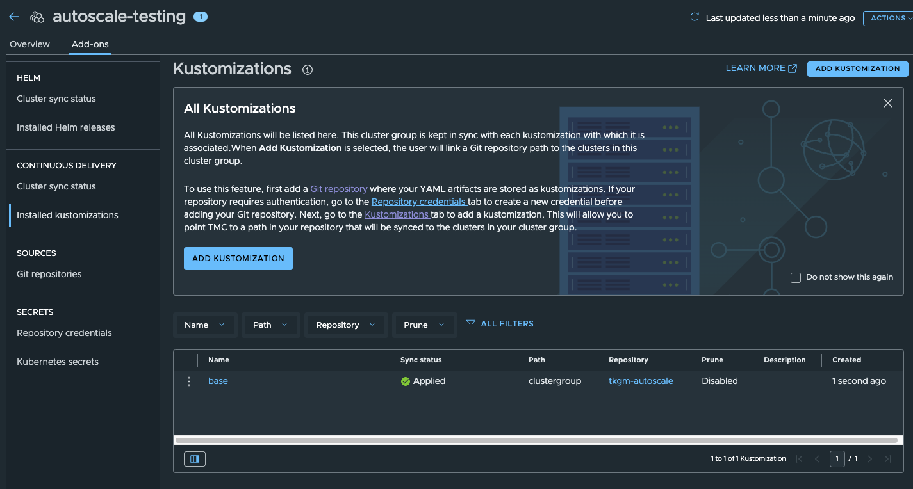

# TKGm Autoscaling

This repo is an example of using cluster autscaler with TKGm when also using gitops and TMC. The current OOTB approach for autoscaling in TKGm uses an overlay and the tanzu cli to install the autoscaler in the mgmt cluster and update the annotations on the workload cluster. This approach does not work well wtih TMC becuase it is client side driven. The approach outlined in the repo works by initially creating a service account in the mgmt cluster that only needs to be done once. Then on each cluster deploy the autoscaler annotations can be added to the node pools through TMC. Once TMC bootstraps the cluster with Flux the autoscaler will be installed into the workload cluster and use the service account to control scaling in the management cluster. This approach of running the autoscaler in the workload cluster is also used by VKS and is outline [here](https://cluster-api.sigs.k8s.io/tasks/automated-machine-management/autoscaling#autoscaler-running-in-workload-cluster-using-service-account-credentials-with-separate-management-cluster).  


## Pre-reqs

* jq
* kubectl
* TMC


## Setup

## Management Cluster

Due to some limitations fo how TMC and TKGm work together there are some things we need to install in the mgmt cluster.

* RBAC for the service account to do autoscaling
* a mutating webhook to add the autoscaling annotations based off of labels and removal of the replicas field. This is due to the limitation of setting the annotations directly in TMC.

1. deploy the service account and mutating webhook
    * Connect to your management cluster kube context
    * `kubectl apply -k mgmt-cluster/` 
    
    
1. get the kubeconfig from the service account to be used in future steps.
    * `mgmt-cluster/generate-kubeconfig.sh` - this generates a kubeconfig and writes it to a file


## TMC

1. enable the CD(flux) capabilties of TMC on a cluster group and use this repo as the bootstrap repo. This example uses a common pattern of having a single cluster group bootstrap repo that dynamically determines the cluster name. You can read more about this pattern [here](https://github.com/warroyo/flux-tmc-multitenant/tree/main?tab=readme-ov-file#clustergroup-bootstrapping).
 
   


1. Create a k8s secret on the TMC cluster group that was used above. This secret should contain the kubeconfig for the service account in the management cluster. Copy the contents of the kubeconfig file that was generated and create the generic k8s secret called  `cluster-autoscaler-mgmt-config-secret` the key should be `value` and the contents should be the kubecofnig.

   

1. Create an initial kustomization on the cluster group to bootstrap it with this repo.

   


1. Create a cluster and add the following labels to the nodepool labels section.

   ```
   cluster.x-k8s.io/cluster-api-autoscaler-node-group-max-size: "5"
   cluster.x-k8s.io/cluster-api-autoscaler-node-group-min-size: "0"
   ```